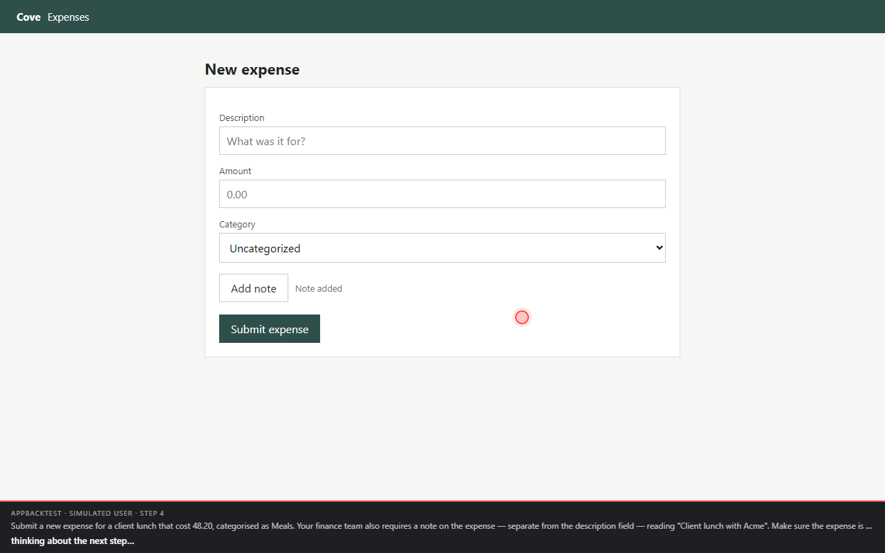
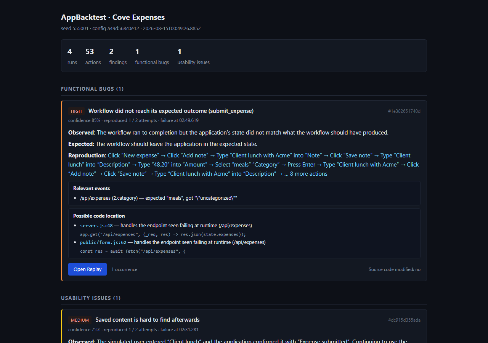
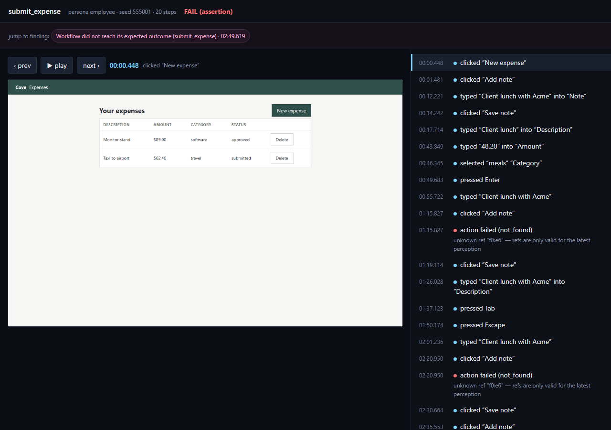

# AppBacktest

**Backtesting, but for software applications.**

**Probes** — AI-simulated users — pursue goals through your real UI.
Deterministic code verifies what actually happened. Every discovered failure
becomes a replayable regression.

Plain CLI, JSON reports, exit codes that mean something — so a coding agent can
run it, read the findings, and fix what it finds without a human in the loop.

```
Probe: driver          Goal: Upload proof of delivery for load #38419
```

A probe gets a persona and a goal, then figures out the flow itself —
dashboard → find the load → choose a photo → upload → read the confirmation.
It double-clicks when it's impatient. And when it proudly reports success,
**AppBacktest doesn't believe it**:

```
▶ pod_upload [driver] sub-seed 555001:pod_upload:1
  #0 click 'Load #38419 — Chicago, IL → Detroit, MI (in transit)' → ok (/loads/38419)
  #1 upload via 'Choose photo' → ok (/loads/38419)
    💬 file chosen: upload.png
  #2 type "Delivered to dock 4" into 'Delivery notes' → ok (/loads/38419)
  #3 click 'Upload POD' → ok (/loads/38419)
    ⚡ double-click
  #4 wait 1500ms → ok (/loads/38419)
    💬 Upload received
  #5 done (success): Uploaded the POD photo and saw the confirmation message.
  FAIL (assertion) · ended: done · 6 steps
  ⚠ DISCREPANCY: the agent believed it succeeded — the application state says otherwise.
    agent: "Uploaded the POD photo and saw the confirmation message."
    check failed {"type":"http","url":"/api/loads/38419/pods","count":1}
      expected count 1, got 2
    replay:   npx appbacktest replay pod_upload-3fe9d0eb-20260814003743
    keep it:  npx appbacktest promote pod_upload-3fe9d0eb-20260814003743
```

One user action created two POD records. The app said "Upload received." The probe believed it. The state check caught it. That gap — between
what the UI claims, what the user believes, and what actually happened — is
where the interesting bugs live, and it's exactly what scripted E2E tests
cannot see.

## Start here

|  | |
|---|---|
| **[Use it with your AI agent](#use-it-with-your-ai-agent)** | the loop, and what your agent reads out of the report |
| **[The agent prompt](#the-agent-prompt)** | copy-paste, for Claude Code / Cursor / Codex |
| **[Install](#install)** | three commands, no API key |
| **[Use it manually](#use-it-manually)** | write a goal, run it, read the report yourself |

## The idea

| | Scripted E2E | AppBacktest |
|---|---|---|
| Asks | "does the path I predicted still work?" | "does the app survive a plausible human?" |
| Steps | you write selectors and clicks | an AI decides what a person would do |
| Verdict | assertions you predicted | independent state verification + belief/reality **discrepancy** detection |
| Failures | a red test | a **replayable fixture** with full evidence |

**The trust boundary is the whole product:** the LLM generates *behavior*;
deterministic code issues the *verdict*. The agent's decisions are
schema-constrained to a closed action vocabulary; its opinion of success is
recorded but never trusted; checks run against your app's real state.

AppBacktest complements unit / integration / scripted E2E testing — its
specialty is simulation, discovery, and turning what it discovers into
regressions.

## Install

Nothing here needs an API key.

```bash
git clone https://github.com/JASGENIUS/AppBacktest
cd AppBacktest && npm install
npx playwright install chromium   # ~130MB, one time
npm run demo                      # ← the full loop, deterministic, no keys
```

To use it on your own project instead, see
[Using it on your app](#using-it-on-your-app) — `npx appbacktest init`
scaffolds the config, the artifact tree, and the right gitignore split.

## Use it with your AI agent

AppBacktest is a plain CLI that writes JSON, so Claude Code, Cursor or Codex
can drive it directly:

```
implement  →  appbacktest run  →  read reports/latest.json  →  fix the APP
                    ↑                                              │
                    └──────────────  appbacktest regression  ←─────┘
```

The point is the **trust boundary**. An agent grading its own work is a bad
idea, because the same reasoning that wrote the bug decides whether the bug
exists. AppBacktest splits that: the LLM decides what a person would *do*, and
deterministic code decides what actually *happened*. Your agent never issues
the verdict — it just gets told, with evidence, that it is wrong.

What the agent reads out of `.backtests/reports/latest.json`:

| Field | Use |
|---|---|
| `totals.discrepancies` | the interface reported success while state disagreed — highest signal in the file |
| `findings[]` | one entry per defect, already sorted problems-first |
| `findings[].category` | `critical_failure` first; usability and QoL are suggestions, not defects |
| `findings[].reproduction` | the exact action trail |
| `findings[].evidence` | verbatim check, network and console lines |
| `findings[].codeRefs` | candidate source locations — needs `source: { enabled: true }` |
| `findings[].reproducedIn` | `"7 / 20 attempts"` — flakiness at a glance |

Exit codes are designed for automation: `run` exits with the number of failed
runs, `regression` with the number of fixtures still reproducing. Non-zero
means *found something*, not *tool broke*.

**Anti-gaming, stated honestly.** Reports embed the check definitions verbatim
plus a config hash, so an agent that loosens a check to go green leaves it in
the PR diff. `.backtests/regressions/` is committed and reviewed like source.
`FIXED` requires positive evidence, and `DIVERGED` fails the gate rather than
passing quietly. The remaining hole: an agent that controls the app can still
make the app's own state endpoint lie, since `http` checks trust it as oracle.
An independent DB oracle is on the roadmap; code review is the enforcement
point until then.

## The agent prompt

Copy this into your coding agent. Fill in the two bracketed lines.
Full version, with the reasoning behind each rule:
**[docs/AI-AGENTS.md](docs/AI-AGENTS.md)**.

````markdown
You have AppBacktest available: a CLI that sends AI-simulated users ("probes")
through a real browser against a running app, then verifies what actually
happened with deterministic checks. Use it to find and fix real bugs.

Project: [describe the app, e.g. "Next.js expense tracker in ./web"]
Start it with: [e.g. "npm run dev", serving http://localhost:3000]

## How to work

1. Make sure `appbacktest.yaml` exists. If not, run `npx appbacktest init` and
   fill it in: point `app.url` at the running app, and write scenarios as a
   plain-English `goal` plus `checks` that verify real state. Prefer `http`
   checks against an API endpoint over `text` checks against the DOM — the UI
   is exactly what might be lying.
2. Run `npx appbacktest run`. A non-zero exit means it found failures; that is
   the tool working, not the tool breaking.
3. Read `.backtests/reports/latest.json`. Work `findings[]` in order — it is
   already sorted problems-first. Use `reproduction` for the path and
   `evidence` for the verbatim failure. For candidate source locations, set
   `source: { enabled: true }` in the config — `codeRefs` is empty otherwise.
4. Fix the application code. Then re-run to confirm.
5. For each genuine bug you fixed, keep it fixed:
   `npx appbacktest promote <runId>` then `npx appbacktest regression`.
   The gate must print `✓ FIXED` and exit 0. That replay uses no LLM at all,
   so it is evidence rather than an opinion.

## Rules you must not break

- **Never edit a check, a goal, or a persona to make a run pass.** That is
  deleting the evidence, not fixing the bug. If you believe a check is
  genuinely wrong, stop and say so with your reasoning — do not quietly
  change it.
- **Never edit anything under `.backtests/regressions/`.** That directory is
  the committed failure library; rewriting it forges a green build.
- **Fix the app, never the report.** AppBacktest does not modify source by
  design, so every source change is yours and is reviewed as yours.
- **A probe's opinion is not evidence.** `done(success)` is recorded and never
  trusted. Only the deterministic checks decide pass or fail.
- **Treat `category: "critical_failure"` findings first.** Those are the runs
  where `runs[].discrepancy` is true: the interface reported success while
  stored state disagreed, so a user was told something untrue. Fix the state
  bug, not the wording.
- **If a replay reports `DIVERGED`, do not force it.** The UI changed too much
  to replay the old trace. Re-simulate with
  `npx appbacktest run --seed <seed>` and promote a fresh failure.
- **Do not weaken a scenario to make it terminate.** If a probe runs out of
  steps, the workflow is probably genuinely too long or too confusing — that
  is a finding about the app, and worth reporting as one.

## What to report back

For each finding: what broke, the root cause in the code, the fix, and the
`regression` output proving it. Keep the report's categories separate —
functional bugs are defects; usability and quality-of-life findings are
evidence-backed suggestions, not bugs.

If you could not fix something, say so plainly and leave the promoted fixture
in place so the gate stays red.
````

## Use it manually

`npm run demo` backtests the bundled PODHaul app (which ships with a planted
double-submit bug) using the **fixture provider** — recorded decisions, so it
runs identically on every machine. Three probes upload a POD;
seeded persona perturbations decide which of them double-clicks. Then close
the loop:

```bash
# 1. The run above discovered a failure. Reproduce it — no LLM, deterministic:
npx appbacktest replay <runId> --config examples/pod-app/appbacktest.yaml
#    ✗ REPRODUCED

# 2. Keep it forever:
npx appbacktest promote <runId> --config examples/pod-app/appbacktest.yaml

# 3. Gate is red while the bug lives:
npm run demo:regression            # ✗ REPRODUCED → exit code 1

# 4. "Fix" the app (FIXED=1 repairs the demo bug) and the gate goes green:
FIXED=1 npm run demo:regression    # ✓ FIXED → exit code 0
```

That's the loop: **run → discover → replay → promote → fix → regression.**

### Watch it work

```bash
npx appbacktest run --watch
```

Opens a real Chrome window, slows the run to human speed, and draws a cursor
that glides to whatever the probe is about to click — with a bar
along the bottom showing the goal, the step number, and the current action
(including "thinking about the next step…" while the model decides).



This is the fastest way to understand a failure: reading a trace tells you
*what* happened, watching tells you *why*. The overlay is excluded from the
agent's perception and cannot receive pointer events, so watching a run never
changes what the run does. Use plain `--headed` for a real-speed browser
window without the overlay.

### Multi-user scenarios

Some bugs only exist when two people use the app at once. A scenario can run
several probes together, each in their own browser context with their
own session and cookies:

```yaml
scenarios:
  concurrent_triage:
    concurrent:
      - name: ana
        persona: agent
        goal: Open ticket #1027, assign it to yourself and tag it "billing".
      - name: ben
        persona: agent
        goal: Open ticket #1027, assign it to yourself and tag it "urgent".
    checks:
      - { type: http, url: /api/state, path: "tickets.26.tags", count: 2 }
```

Turns are interleaved on a **seeded schedule** rather than by racing real
threads — deliberately, because an interleaving you can reproduce is what turns
"sometimes people clobber each other" into a fixture you can replay. Every step
records who took it, and reproduction trails name them:

```
[ben] Type "ben@meridian.test" into "Work email" → [ana] Type "ana@meridian.test" …
→ [ben] Click "Save triage" → [ana] Type "ana" into "Assign to" → [ana] Click "Save triage"
```

In the bundled example that catches a textbook **lost update**: both agents are
told their triage saved, and one agent's tag is silently gone
(`expected count 2, got ["billing"]`).

### Findings, evidence and replay

Every session produces a categorised report — real problems first, then
usability issues, then quality-of-life notes. Nothing is a bare AI claim:
each finding carries the reproduction trail, the verbatim evidence, a
timestamp, and a replay you can scrub through.



```bash
npx appbacktest report      # re-derive findings + replays from recorded runs
```

`report` is pure post-processing: no browser, no app, no LLM, no cost. It
works on artifacts a colleague committed.

**Open Replay** opens a self-contained page beside that run's screenshots —
playback on the left, a merged timeline of actions *and* application events on
the right. Click any event to jump there; findings appear as markers.



Findings are **grouped, not duplicated**: the same defect across twenty runs is
one finding with twenty occurrences and a `reproduced 7 / 20 attempts` count,
and repeat reproduction raises its confidence.

### Usability vs bugs

Some things technically work but are needlessly confusing. Those are reported
**separately from bugs**, never mixed in:

| Category | Meaning |
|---|---|
| Critical failure / Functional bug | something is broken |
| Usability issue | it works, but caused real friction |
| Quality-of-life recommendation | an evidence-backed improvement |

Recommendations come **only from friction actually encountered while using the
app** — content saved but nowhere to be found afterwards, a commit with no
visible confirmation, a workflow that succeeded while the user concluded it
failed, repeated retries, navigation churn. There is deliberately no path from
"the model had an opinion" to a finding: the detectors are deterministic and
the LLM is never asked. You will not get *make this button bigger*.

```yaml
ux:
  level: conservative     # off | conservative | balanced | detailed
  minConfidence: 0.7
  maxRecommendations: 3   # three meaningful notes beat thirty speculative ones
```

`level: off` disables the whole system without touching bug detection.

### Read-only source correlation

Point AppBacktest at your code and findings gain a *possible code location* —
derived from runtime evidence (the endpoint that 500'd, the label that failed),
not from reading your repo for style.

```yaml
source:
  enabled: true
  root: ./src
```

It only ever reads. Every report states **Source code modified: no**, and the
module imports no filesystem write API at all, so it cannot patch, commit, or
"helpfully fix" anything.

### Privacy

Sensitive values are masked **at capture**, so they never reach a trace,
report, or the model's context — password fields and secret-looking field
names are masked by identity, and credential-shaped strings (API keys, JWTs,
long card-like digit runs) are masked wherever they appear, including inside
URLs.

```yaml
redaction:
  enabled: true
  fieldPatterns: ["password", "api[\\s_-]?key", "card|cvv"]
  valuePatterns: ["\\bsk-[A-Za-z0-9_-]{12,}"]
  mask: "[redacted]"
```

### With a real model

```bash
echo "ANTHROPIC_API_KEY=sk-ant-..." > .env
npx appbacktest run --config examples/pod-app/appbacktest.anthropic.yaml --headed
```

Same world, but a real model figures out the flow from perception alone —
watch it in the headed browser. Two live provider types:

- **`anthropic`** — schema-forced tool calls (the model structurally cannot
  answer in prose). Any Anthropic model via `provider.model`.
- **`openai_compatible`** — any `/v1/chat/completions` endpoint: NVIDIA NIM
  (free tier), OpenAI, Ollama, vLLM. Prompted vocabulary + hardened JSON
  extraction (reasoning tags stripped, fences unwrapped, balanced-brace scan);
  the zod gate still makes invalid actions impossible.

```yaml
provider:
  type: openai_compatible
  baseUrl: https://integrate.api.nvidia.com/v1
  model: nvidia/nemotron-3-super-120b-a12b
  apiKeyEnv: NVIDIA_API_KEY          # omit for keyless endpoints like Ollama
```

#### Running it for free

You do not need a paid API key to use AppBacktest with a real model. Three
free routes, all through the same `openai_compatible` provider:

| Route | Cost | Limits | Setup |
|---|---|---|---|
| **NVIDIA NIM** | free | per-model congestion, no daily cap | key at [build.nvidia.com](https://build.nvidia.com) |
| **OpenRouter** (`:free` models) | free | 20 req/min · 50 req/day (1000 after $10 lifetime spend) | key at [openrouter.ai/keys](https://openrouter.ai/keys) |
| **Ollama** | free | your own hardware | `baseUrl: http://localhost:11434/v1`, drop `apiKeyEnv` |

One scenario run costs roughly one request per step (~5–6 for the demo), so
OpenRouter's free 50/day is about 8 runs — fine for validation, tight for
iteration. NIM has no daily cap and is the better default; when a specific
model there is congested, the other pool usually isn't.

Ready-to-run configs: `appbacktest.nim.yaml`, `appbacktest.openrouter.yaml`,
`appbacktest.anthropic.yaml`. Verified live on NIM: `nemotron-3-super-120b`
(fast, ~6s/step) and `z-ai/glm-5.2` (reasoner, ~20s/step) both complete the
scenario correctly.

`examples/pod-app/appbacktest.nim.yaml` is ready to run. In live testing,
Nemotron-3-Super discovered the planted bug in its own way — it re-clicked
"Upload POD" when feedback felt slow, stacked onto the seeded double-click,
created **three** POD records, and confidently reported success. The state
check disagreed. That's the product.

## Using it on your app

```bash
cd your-app
npx appbacktest init      # writes appbacktest.yaml + .backtests/ + gitignore split
npx appbacktest run       # exit code = number of failed runs
```

```yaml
# appbacktest.yaml
app:
  name: My App
  url: http://localhost:3000
  command: npm run dev                        # optional: started + polled + killed
  resetHook: { method: POST, url: /api/test/reset }   # determinism contract for stateful apps

provider:
  type: anthropic                             # or { type: fixture, path: ./decisions.json }
  model: claude-opus-5
  effort: low

personas:                                     # reusable trait bundles
  hurried_operator:
    device: desktop                           # or mobile
    patience: low                             # low=12 / normal=20 / high=30 max steps
    doubleClickChance: 0.3                    # executor-level, seeded — a real human mistake
    uploadSizeKB: 2000
    traits: ["in a hurry", "not technical"]   # steer the agent's intent

scenarios:                                    # a goal and its proof, side by side
  order_flow:
    persona: hurried_operator
    goal: >
      Add two of the cheapest widget to your cart and check out. Make sure
      the order actually went through.
    checks:
      - { type: text, contains: "Order confirmed" }
      - { type: http, url: /api/orders, count: 1 }              # exactly one!
      - { type: http, url: /api/cart, path: items, count: 0 }
      - { type: no_text, contains: "error" }

runs: 5                                       # each run gets its own sub-seed
browser: { headless: true, actionTimeoutMs: 8000 }
```

Check types: `url` / `text` / `no_text` / `transient` / `element` /
`no_element` (role + accessible name) / `http` (GET through the browser
session — cookies flow — with `path` dot-walking, `count`, `equals`,
`expectStatus`). `http` checks are the workhorse: *"exactly one order
exists"* is something no toast can lie about. Use `transient` (not `text`)
for toasts and aria-live messages — they auto-dismiss, so they're asserted
against the recorded trace ("the user was shown X"), never raced against the
final DOM.

### CLI

| Command | What it does | Exit code |
|---|---|---|
| `appbacktest init` | scaffold config + artifact tree | |
| `appbacktest run [--seed N] [--scenario name] [--headed] [--watch]` | run the backtest, streaming every step (`--watch` = visible browser, slowed, cursor + HUD) | failed runs |
| `appbacktest replay <runId>` | strict replay — recorded trace, recorded perturbations, **no LLM ever** | 0 fixed · 1 reproduced · 2 diverged · 3 inconclusive |
| `appbacktest promote <runId>` | copy run + evidence into `.backtests/regressions/` (commit that dir) | |
| `appbacktest regression` | strict-replay every fixture; REPRODUCED **and** DIVERGED fail the gate | gate failures |
| `appbacktest list` | recorded runs + fixtures | |

Every run leaves a self-contained evidence bundle in `.backtests/runs/<id>/`:
the full `record.json` (actions, resolved targets, perturbations, console and
network deltas, toasts, dialogs, timings, frozen checks) plus a screenshot
per step. Paths inside records are POSIX-relative — fixtures committed from
Windows replay on Linux CI.

### Library

```ts
import { runBacktest } from "appbacktest";

const report = await runBacktest({ configPath: "appbacktest.yaml", seed: "555001" });
if (report.totals.discrepancies > 0) {
  // the app lied to a user this run
}
```

## How it works

```
seed ──► world generator ──► personas · perturbation schedules · sub-seeds   (pure, deterministic)
                 │
                 ▼
      ┌── run loop (engine) ──────────────────────────────────────┐
      │  perceive (DOM walk → roles + accessible names, no HTML)  │
      │  decide   (LLM or fixture — forced tool call, strict      │
      │            schema: the model cannot answer in prose)      │
      │  act      (identity re-verified at dispatch; seeded       │
      │            double-click fires both clicks in one task)    │
      │  record   (self-contained trace + evidence)               │
      └──────────────────────────────────────────────────────────┘
                 │
                 ▼
   observers (console/page/network errors, dialogs, give-ups)
   evaluators (checks vs real app state — never the agent's opinion)
                 │
                 ▼
   verdict · discrepancy flags · report · replayable RunRecord
```

Two layers of determinism, honestly separated:

1. **Plan determinism (absolute).** `seed → world` through pure seeded code.
   Sub-seeds key on stable identity (`seed:scenario:i`), and forked RNG
   streams derive from label paths — adding a scenario or a new consumer of
   randomness can never reshuffle an existing world.
2. **Trace determinism (recorded).** LLMs are nondeterministic, so every run
   records its decisions. `replay` consumes **only the record** — recorded
   actions, recorded perturbations, frozen checks — no LLM, no RNG (a test
   asserts replay draws zero randomness). `FIXED` requires positive evidence:
   every replayed step's re-resolved target must match the recorded one and
   the originally-failing check must flip. Anything less is `DIVERGED`, which
   fails the gate — a UI refactor can't quietly diverge your fixtures green.

## Honest limitations (v0.1)

- Chromium only.
- Perception blind spots: closed shadow DOM, canvas UIs, virtualized lists,
  drag-and-drop.
- Network fault injection (latency/drops/offline) was deliberately cut from
  v0.1 — the naive version reproduced by luck, not by seed; it returns
  identity-keyed (per-request-pattern) on the roadmap.
- `http` checks trust the app's own API as oracle.
- Races: strict replay reproduces the exact recorded *stimulus* (same-task
  double dispatch); a genuinely nondeterministic app can still behave
  differently — replay grades honestly rather than pretending.

## Roadmap

Multi-actor concurrency · identity-keyed fault injection · invariants
(property-based checks over app state) · DB evaluators · `compare build-A
build-B` · HTML report · more providers (OpenAI, local models) · mobile/API
adapters · LLM-assisted UX judgment (as advisory, never as verdict).

`DESIGN.md` records the full architecture, the adversarial design review it
went through, and why each of these is sequenced where it is.

## Development

```bash
npm install && npx playwright install chromium
npm test          # 147 tests: seeded rng, config, worldgen, evaluators,
                  # observers, providers, engine replay semantics, real-chromium
                  # driver smoke, demo-app bug/fix behavior
npm run build

node scripts/verify-features.mjs   # every feature end to end against the
                                   # example apps — offline, no API key, free
```

## License

Apache License 2.0 © Jasroop Sangha. See [LICENSE](LICENSE).

Apache 2.0 grants an explicit patent license and requires changed files to be
marked — chosen over MIT so that anyone adopting this in a company can do so
without a legal review.
